# Adaptive Extended Kalman Filter – Full Process Noise Covariance Update

This repository revisits Professor Gregory L. Plett’s Adaptive Extended Kalman Filter (AEKF) implementation [2] and removes a common steady‑state simplification that many papers apply to the process‑noise covariance adaptation.  By restoring the full expression the filter delivers tighter uncertainty bounds and lower state‑estimation error. To regain numerically stability the positive‑definiteness can be ensured with the nearest symmetric positive‑definite (SPD) matrix using Higham’s method.

---

## Key Update:  Revisiting the Process Noise Covariance Update
Adaptive EKF literature assumes that the process noise covariance has reached steady state and therefore drop the term that captures the change in a‑posteriori process noise covariance between consecutive steps [^1].  

Although this avoids negative‐definite updates, it also under‑estimates process noise and widens the confidence bounds.

| Symbol                   | Meaning                                                |
| ------------------------ | ------------------------------------------------------ |
| \$\mathbf{K}\_i\$        | Kalman gain at sample \$i\$                            |
| \$\nu\_i\$               | Innovation (residual) vector at \$i\$                  |
| \$\mathbf{\Phi}\_{i-1}\$ | Discrete state‑transition matrix from \$i-1\$ to \$i\$ |
| \$\mathbf{Q}^{+}\_i\$    | A‑posteriori process noise covariance at \$i\$           |

### A)  Common Steady‑State Form (from Eq. 37 [1])
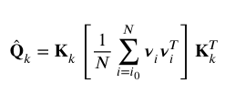

This simplification likely serves to preserve the **positive definiteness** of the process noise covariance matrix.  

### B)  Full Maximum‑Likelihood Expression Implemented Here (from Eq. 36 [1])
The full update for the process noise covariance matrix is:
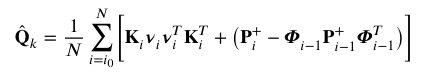

However, that “steady-state difference”, exposed with parenthesis, usually stabilize at an application-specific value **greater than zero**.

---

## Test
The key update was benchmarked with the nonlinear spring mass damper system:
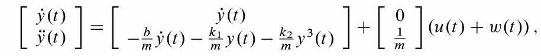
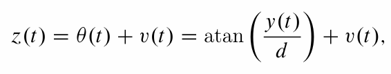

Designed and simulated by Prof. Plett in Simulink as:
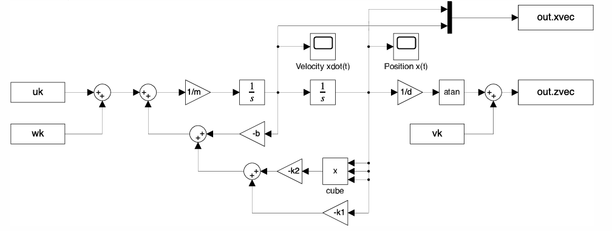

with m=50, b=2, k1=4, k2=60 and d=0.25.

---

## Results

| Test Case                         | RMS Error | Time Outside ±2σ |
|----------------------------------|-----------|------------------|
| **Baseline – steady-state** (A)  | 9.69 × 10⁻³ | 0.15 %     |
| **Full $\mathbf Q$**             | 2.35 × 10⁻³ | 0.30 % (B) |
| **Full $\mathbf Q$ + Higham**    | 4.26 × 10⁻³ | 0.35 % (B) |

(A): The “cumulative-sum instead of moving-average” hot-fix is used for better performance.

(B): The *time-error-outside-bounds* metric is most informative here, because the width of the confidence band is set by the state-error covariance $\mathbf{Q}$. A larger covariance (often driven by a larger $\mathbf{Q}$) widens the band, making it easier for the estimate to stay inside. Thus the baseline—whose bounds are widest—naturally shows the lowest “outside-bounds” percentage which may not be best, as the figures below illustrate.

---

### Plots

#### Benchmark (1):
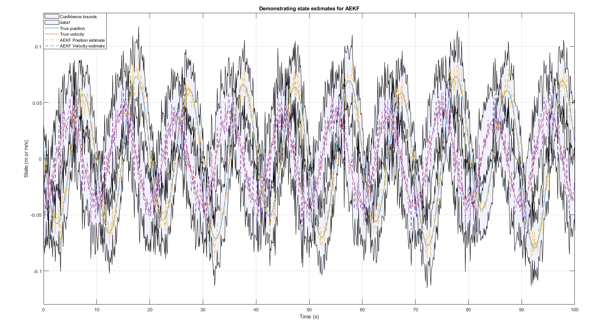  
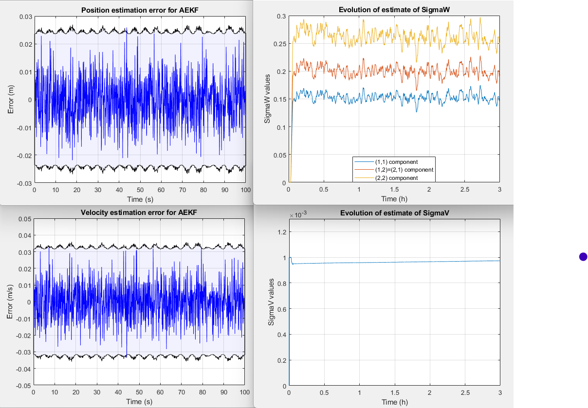

---

#### Full Q Expression (2):  
As expected, the covariance matrix occasionally **lost positive definiteness**, likely due to the subtractive term.  
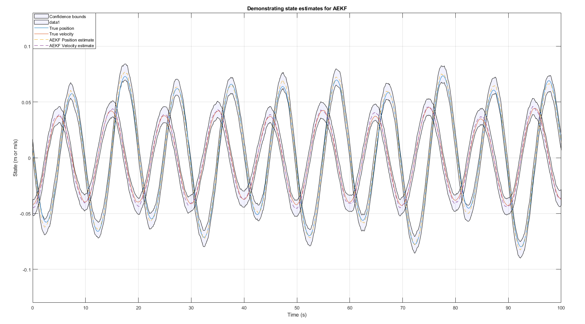  
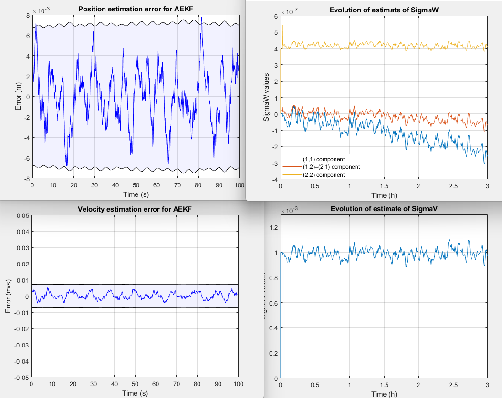

---

#### Full Q + Higham Method (3):  
This approach applies Higham’s algorithm to maintain numerical stability.  
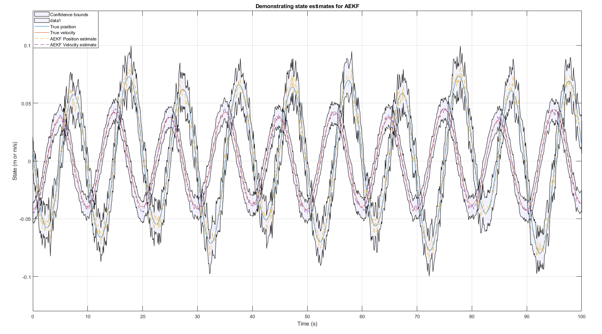  
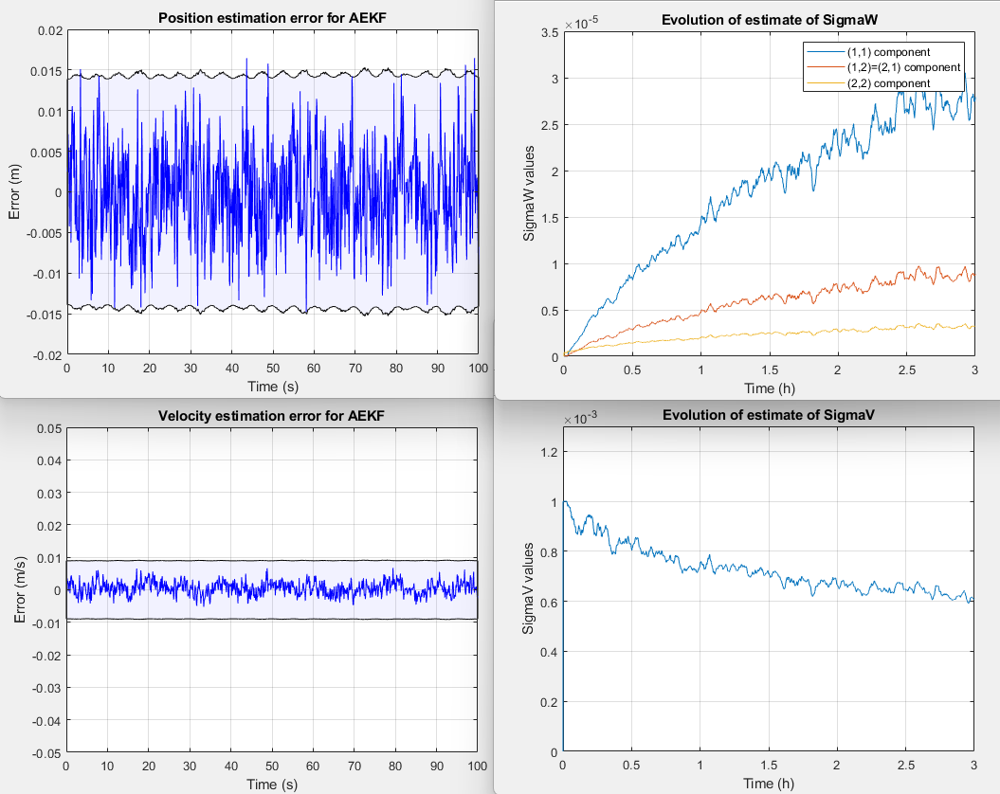
---

## Conclusions & Next Steps

Restoring the complete covariance adaptation renders the AEKF **more truthful to the underlying theory** and, for the test problem, materially improves estimation accuracy. Future work includes:

1. Explore a  Kalman Filter expression that avoids the subtractive term of the process covariance update to maintain numerical stability without the Highman projection safeguard.

2. Investigating adaptive measurement‑noise tuning in parallel.

---

## References

 [1] Fraser, C. T., & Ulrich, S. (2021). *Adaptive extended Kalman filtering strategies for spacecraft formation relative navigation*. Acta Astronautica, 178, 700–721. https://doi.org/10.1016/j.actaastro.2020.10.016

[2] *Nonlinear Kalman Filters and Parameter Estimation*, Coursera. Offered by the University of Colorado Boulder. Retrieved from [https://www.coursera.org/learn/nonlinear-kalman-filters-parameter-estimation](https://www.coursera.org/learn/nonlinear-kalman-filters-parameter-estimation)

---

## Acknowledgments & Copyright
The original source code was developed by Prof. Gregory L. Plett and is reproduced here with proper attribution for academic and educational use.  
All updates and modifications are made in good faith to support the research community.
> If you are the original author and would prefer different credit or removal, please open an issue or contact me directly.
