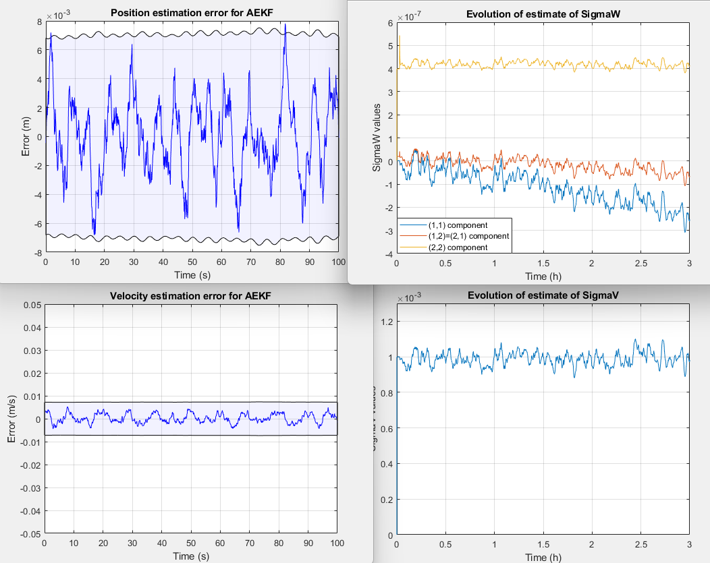

# Adaptive Extended Kalman Filter Update

This repository contains an improved version of an AEKF algorithm originally developed by Prof. Gregory L. Plett.  
The original code is preserved in this repository (see `/legacy` or commit history), and the updates made here include:
- Use of the full expression for the adaptation of the process noise covariance
- Improved numerical stability
- Modularized plotting code

---

## Key Update

The full update for the process noise covariance matrix is:

Then some papers use the following assumption:
> *“The parenthetical term contains the change in the error covariances between the current and previous time steps. If the filter has reached steady-state operation, as was assumed earlier in the derivation, then the term in parentheses is approximately zero.”*
> — *Fraser & Ulrich (2021)*

This simplification likely serves to preserve the **positive definiteness** of the process noise covariance matrix.  
However, that “steady-state difference” usually stabilize at an application-specific value **greater than zero**.

There may exist other Kalman Filter expression that avoid this subtractive term altogether.

---

## Results

### 1. Benchmark (original formulation using cumulative sum instead of moving average):
- RMS state estimation error: `0.00425548`
- Time error outside bounds: `0.34965%`

### 2. Full expression for Q with same smoothing technique:
- RMS state estimation error: `0.0023486`
- Time error outside bounds: `0.2997%`

### 3. Full expression with Higham method for positive definiteness:
- RMS state estimation error: `0.00969069`
- Time error outside bounds: `0.14985%`

---

### Plots

#### Benchmark (1):
  

---

#### Full Q Expression (2):  
As expected, the covariance matrix occasionally **lost positive definiteness**, likely due to the subtractive term.  
  

---

#### Full Q + Higham Method (3):  
This approach applies Higham’s algorithm to maintain numerical stability.  
  

---

## 📚 References

- Fraser, C. T., & Ulrich, S. (2021). *Adaptive extended Kalman filtering strategies for spacecraft formation relative navigation*. Acta Astronautica, 178, 700–721. https://doi.org/10.1016/j.actaastro.2020.09.014

- *Nonlinear Kalman Filters and Parameter Estimation*, Coursera. Offered by the University of Colorado Boulder. Retrieved from [https://www.coursera.org/learn/nonlinear-kalman-filters-parameter-estimation](https://www.coursera.org/learn/nonlinear-kalman-filters-parameter-estimation)

---

## Acknowledgments & Copyright
The original source code was developed by Prof. Gregory L. Plett and is reproduced here with proper attribution for academic and educational use.  
All updates and modifications are made in good faith to support the research community.
> If you are the original author and would prefer different credit or removal, please open an issue or contact me directly.
